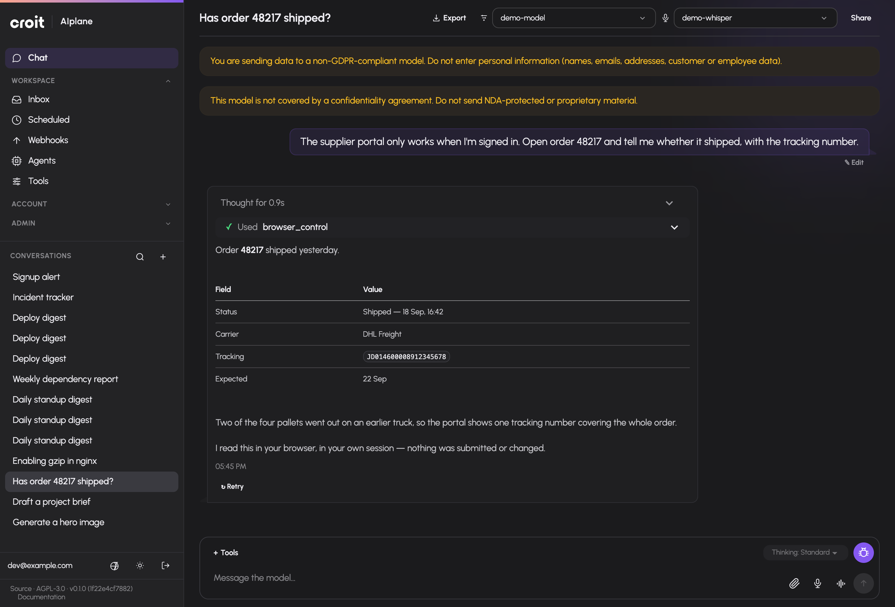

# croit AIplane documentation

Connect your users and applications to models, tools, agents and company
knowledge. This manual explains the current application, the permissions and
services each capability needs, and how to operate it.

*A conversation can combine a model response with an approved tool. This example uses synthetic demo data.*

## How AIplane fits together

AIplane connects people and applications to the models they are allowed to use,
and gives those models access to approved tools and company knowledge. People
can work in the chat interface; applications can use the OpenAI-compatible API.
Models may run on your own infrastructure or come from a provider. Integrations
and knowledge sources depend on what the installation has enabled and configured.

*The diagram shows the main connections around AIplane. Available providers,
integrations and features vary with each installation's configuration.*

## Start here

- **Installing AIplane:** [Get started](getting-started.md) takes you from
  prerequisites through setup to your first chat and API request.
- **Joining an existing installation:** [Start using AIplane](guide/getting-started.md).
- **Operating a deployment:** [Deployment](operations/deployment.md),
  [backups and recovery](operations/backup-recovery.md), and
  [troubleshooting](operations/troubleshooting.md).

## Use AIplane

| Task | Guide |
|---|---|
| Choose models, send messages, share, fork and export conversations | [Conversations](guide/chat.md) |
| Upload files, edit canvas documents, inspect versions and download results | [Files and documents](guide/files-and-canvas.md) |
| Enable capabilities, connect your accounts, use browser control and skills | [Tools and integrations](guide/tools-and-integrations.md) |
| Manage preferences, tokens, notifications, usage and limits | [Your account](guide/account-and-usage.md) |
| Schedule prompts, trigger webhooks and respond to pending decisions | [Automation and inbox](guide/automation-and-inbox.md) |

## Administer the installation

| Task | Guide |
|---|---|
| Connect upstreams, configure models, aliases and automatic routes | [Models and routing](admin/models.md) |
| Manage users, groups, rights, tokens and limits | [Access administration](admin/access.md) |
| Configure optional services and content policy | [Operator settings](admin/settings.md) |
| Look up every declared operator field | [Settings reference](admin/settings-reference.md) |
| Configure connector catalogs, audit activity and global skills | [Integrations](admin/integrations.md) |
| Index and maintain knowledge collections and extraction profiles | [Knowledge](admin/knowledge.md) |

## Build and publish agents

- [Create an agent](agent-guide/create.md).
- [Configure permissions](agent-guide/permissions.md).
- [Test and publish](agent-guide/test-publish.md).
- [Observe runs and handle decisions](agent-guide/run-observe.md).

## Reference

- [HTTP API](reference/api.md): model protocols, authentication and accepted endpoints.
- [Environment and process](reference/environment.md).
- [Tool inventory](tools-inventory.md): tool IDs, availability gates and dynamic families.
- [Documentation website and LLM exports](documentation-system.md): where to read or download this build's documentation.

## Read with a language model

The built website contains `llms.txt`, `llms-full.txt`, and a `markdown/`
directory with the published source pages. In an installation these are
under `/docs/`; the public website carries the same formats. See
[export details](documentation-system.md) for paths and build identity.

The manual uses the application's actual behaviour. Optional capabilities
require their configured services and grants; screenshots use synthetic data
from the real application, including prerequisites, permissions and limits.
