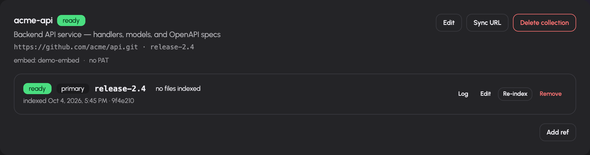

# Build and maintain knowledge collections

Knowledge collections make indexed source material available to retrieval tools such as `rag_search`. The collection manager (`/rag`), editors and extraction profiles require the `admin` role. A user or agent searching a collection needs the relevant retrieval tool and access to that collection.

Before creating a collection, enable RAG with a persistent data directory in [system settings](settings.md), and configure an embeddings pool in [Models and routing](models.md). Source credentials must be able to read the material being indexed.

## Create a collection

1. Open **Knowledge** (`/rag`) and select Add collection (`/rag/new`).
2. Enter a meaningful name and description. These identify the actual corpus to users and models.
3. Choose the source provider and complete its displayed fields. Built-in remote providers are WebDAV, Google Drive and HyperKitty, alongside Git sources.
4. Select an embedding model. Optional extraction profiles also need an extraction model.
5. Set file include/exclude patterns, chunk size/overlap, refresh schedule and allowed groups.
6. Save. Follow indexing status and the source log on the collection card.
7. Once indexed, test retrieval using an allowed account and a question whose answer you can verify in the source.

The editor proposes chunk size 800 and overlap 100, a daily refresh interval and Git ref `main`. These are form defaults: change them to match your source. Chunk size must be positive and overlap must satisfy `0 <= overlap < chunk_size`. Refresh is in minutes; presets are on demand (`0`), hourly (`60`), daily (`1440`) and weekly (`10080`). A custom stored interval is displayed without rounding it to a preset.

### Source-specific setup

| Source | What to configure and verify |
|---|---|
| Git | Clone URL, branch/tag/commit and optional personal access token |
| WebDAV | Provider's server/root/credential fields; test the account's access to the chosen tree |
| Google Drive | Provider configuration and the collection's OAuth connection; check connected account metadata |
| HyperKitty | Archive settings offered by the provider; verify readable archive content |

The provider registry supplies the source form's own fields and descriptions. Do not treat mentions of other storage providers in architectural examples as evidence that they are installed. Use the actual source menu.

For non-Git sources, **Test source** checks the configured provider and reports account/root information or its error. For Git, the editor explains that indexing tests access rather than claiming to have run that same remote-source test. An existing stored secret is not returned to the editor. If a source test needs new settings together with a secret, the server may require re-entering the secret to test that combination.

## Choose versioned or aggregate search

- **Versioned collection:** Index separate refs of one Git repository. Set a primary ref for the default search view. Add other branches/tags when callers need those versions.
- **Aggregate collection:** Combine multiple Git sources into one search corpus. Add a repository URL and optional ref for each source; the primary aggregate index represents the shared search view.

An aggregate collection is not ready merely because its empty container was created. Add sources and check the aggregate indexing status. In the collection card, the source dialogs support adding one source and bulk source input. Bulk input uses one `URL [ref]` per line; blank lines and lines beginning with `#` are ignored. A leading `@` on a ref is accepted. Read the result's added/skipped counts.

## Maintain indexing

The collection card shows source/model/access metadata, status and individual source rows. Actions include:

- **Edit collection:** Change source configuration, extraction/embedding settings, patterns, chunking, refresh and access. Changes to the index shape queue rebuilds.
- **Reindex:** Request a full rebuild, rather than only checking for changed source content.
- **Log:** Open indexing messages and errors for the selected source.
- **Edit source:** Change its URL/ref through the source dialog.
- **Set primary:** Change the default ref for a versioned collection.
- **Remove source / Delete collection:** Confirm removal before deleting the corresponding resource.

Statuses distinguish pending, cloning, indexing, ready and error. Read the recorded last error and log before retrying. A ready index proves that an indexing pass completed; verify answer quality against the source separately.

### Trigger synchronization externally

Use the collection's sync-token action to create or rotate a synchronization URL. The card displays a `curl -X POST` example after creation. Treat the URL as a credential: whoever holds it can trigger the permitted sync operation. Rotation replaces the credential. Clear disables that token. Keep the URL out of screenshots and public documentation.

## Extract structured metadata with profiles

Open `/rag/profiles` when documents should produce metadata such as dates, counterparties or amounts, alongside searchable text.

1. Create a profile with a name, description and extraction prompt.
2. Define its fields as JSON. Each has `key`, `label` and `type`; supported types are `text`, `number`, `date` and `enum`. Fields can also have description, enum values, `filterable` and `sortable` flags.
3. Save the profile.
4. Select it on a collection with an extraction model.
5. Index and inspect whether retrieved metadata matches the documents.

For example, a date field's `sortable` flag makes its extracted dates suitable for ordering, while a counterparty field's `filterable` flag allows narrowing search. The labels and prompt must describe real source content.

The profile list shows version and built-in status. Editing reports the collections requiring reindexing; their stored extraction data must be refreshed to reflect the new profile. The form offers Delete for non-built-in profiles. Invalid JSON or a failed save is shown on the profile card. Do not interpret a saved profile as proof that extraction has already run on every collection.

## Troubleshooting

| Symptom | Check |
|---|---|
| Knowledge page is forbidden | `admin` role; collection management is administration |
| No embedding models | Embeddings pool, backend health and advertised models |
| Cloning or source access fails | Actual URL/ref, provider account and credentials |
| Source test asks for credentials again | Changed settings with write-only stored secrets |
| Collection stays unconfigured | Required source rows and indexing prerequisites |
| New documents do not appear | Refresh interval, sync result, include/exclude patterns and log |
| Profile changes do not affect results | Reindex the affected collections |
| User cannot retrieve collection | Allowed groups and retrieval-tool grant |
| Search is outdated after a settings edit | Rebuild status and last indexed ref/commit |
