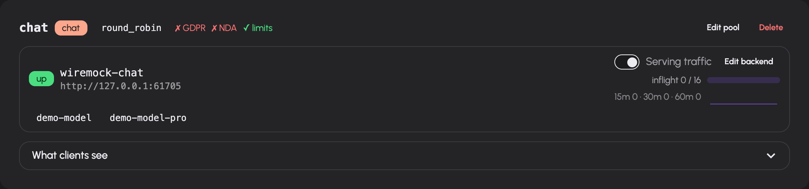

# Connect models and control routing

An **upstream backend** is a model server or provider endpoint. A **pool** groups backends for a purpose such as chat, embeddings, transcription or OCR. The **model catalog** is the set of models and aliases exposed by that topology. Configure these before selecting models for chat, agents or optional features.

You need a signed-in account with the `admin` role. Open **Administration → Models and routing** (`/admin/models`). Its tabs are **Upstreams**, **Catalog**, **Defaults** and **Automatic routing**. `/admin/upstreams` also opens the upstream manager.

## Add a backend and pool

1. In **Upstreams**, add a pool. Choose its name, kind and selection strategy. Set allowed groups and the GDPR/NDA declarations to match the actual provider arrangement.
2. Add a backend. Enter a unique name and its API base URL. Select the pool. Configure a stored API key or an environment-variable key source if required.
3. Use the backend's connection test. Read which credential source was used, the HTTP result and the discovered models. A connection test does not save or apply the backend.
4. Set the health path, request weight and maximum in-flight requests. Configure explicit models when the upstream cannot advertise them, and aliases when clients need stable model names.
5. Save the editor. Inspect the pending changes banner, then **Apply** the topology changes.
6. Confirm that the backend reports healthy and that its models appear in **Catalog**.

The saved topology and the running topology are distinct. Editing a URL, pool membership or capacity does not complete the operation until pending changes have been applied. Live status updates show health, authentication failures, in-flight requests and advertised models.

### Backend fields

| Field | Why configure it? |
|---|---|
| Base URL | Address of the upstream API, including its API prefix where required |
| API key / environment variable | Authentication for that upstream; a stored key is not displayed back as plaintext |
| Health path | Endpoint used to check availability; the new-backend form proposes `/models` |
| Weight | Relative weighting used by strategies that consider weight |
| Maximum in-flight | Concurrent requests admitted to this backend; the form proposes 16 |
| Models | Explicit advertised model names |
| Aliases | Stable public name, optionally mapped to an upstream model using `alias=target` |
| Image editing support | Declares whether an image-generation backend can perform editing |

The connection test distinguishes authentication failure, timeout, unreachable server, other HTTP errors and a reachable endpoint that advertises no models. Fix the reported cause before applying. An environment-variable name is useful only when that variable is set in the running AIplane process.

### Pool fields

Choose the pool's purpose from the kinds offered by the server. The editor also configures backend membership, explicit pool models, allowed groups, offline fallback, compliance declarations and whether usage limits apply. Speech pools have language-to-voice mappings and an offered-voices list.

| Selection strategy | Behavior |
|---|---|
| `least_inflight` | Chooses based on current in-flight load; the new-pool form's default |
| `round_robin` | Distributes requests in rotation |
| `prefix_affinity` | Keeps matching request prefixes on the same replica where practical, while avoiding overloaded replicas; requests with no usable prefix fall back to least-in-flight selection |

Prefix affinity is useful for self-hosted replicas with separate prompt-prefix caches. It is separate from an automatic route's session affinity: one chooses a backend replica, the other retains a selected model target.

GDPR and NDA flags are operator declarations. They do not inspect the provider's contracts. Allowed groups govern pool access; configure them together with [group permissions](access.md). Review an offline fallback's availability and rights before relying on it.

Backend and pool names can be changed through their editors. Deletion removes the configured resource; inspect and apply the resulting topology change. Do not overwrite another resource's name without reviewing the editor's explicit overwrite warning.

Use a backend card's serving toggle to drain or re-enable it. The toggle changes admission immediately; inspect the live in-flight count when draining for maintenance. The upstream manager also has a fallback per pool kind for unknown-model requests. Changing that fallback is live immediately and is distinct from a pool's offline fallback or a feature's default model.

## Configure a model

1. Open **Catalog**. Search by model name or use the chat, other, aliases or configured filter.
2. Open the model editor (`/admin/models/edit`).
3. Set input/output prices in the unit shown for that model kind. Configure prices before treating monetary usage totals as complete.
4. For a chat model, verify its context window, reasoning format and capabilities against the upstream's actual configuration.
5. Save. Return to the catalog and inspect the configured values.

Chat overrides include reasoning styles `none`, `qwen`, `openai`, `glm`, `anthropic` and `ollama`; token budgets or effort values for standard/deep/max reasoning; vision, tools, structured output, audio input, PDF input and parallel tools; and fallback models for vision and tools. Capability fields distinguish **unknown**, **enabled** and **disabled**. Unknown is not proof of support.

The context-window hint warns when an override exceeds the detected upstream window: AIplane cannot enlarge the upstream's actual context capacity. The TOML defaults field accepts model request defaults. **Clear overrides** removes a chat model's overrides; non-chat model editors expose pricing only.

## Set feature defaults

Open **Defaults** and choose the chat, transcription, speech, image or embedding default. The selection saves immediately. Clearing a selection removes the explicit feature default. Defaults choose from the existing model catalog; they do not add backends or grant access. If a feature has no suitable available model, fix its upstream pool before changing the default.

## Create an automatic route

Use an automatic route when clients should request a stable alias and AIplane should choose among known chat models for each request.

1. Open **Automatic routing** and add a route. The form requires an available selector and at least two candidate models.
2. Set the alias, selector model and quality/balanced/cost objective.
3. Give every candidate a unique key, a real model target and a description of its intended workload. These descriptions inform selection.
4. Choose a fallback from the candidates. Set confidence threshold and selector timeout.
5. Begin with **Shadow** rollout. Save and send representative requests to the alias. Inspect recent decisions.
6. Select **Active** when those decisions meet your requirements.

The editor proposes confidence `0.7`, timeout `1500 ms`, shadow rollout, disabled session affinity and a one-hour affinity lifetime. Its timeout range is 100–30000 ms; affinity lifetime is 60–604800 seconds. Shadow records the selector's choice while using the fallback target. Active routing can select a candidate; low confidence or selector failure uses the fallback.

The selector receives request content. Treat its provider as another processor of that content. Session affinity can retain a choice across related requests; it has an explicit lifetime. The decision table identifies route version, effective target, confidence, latency and outcomes such as selection, shadow, low confidence, selector error or affinity. Edit existing routes to revise their policy; delete a route only after checking its callers.

## Troubleshooting

| Symptom | Check |
|---|---|
| Saved backend is not used | Pending changes and Apply |
| Authentication badge/error | Test's credential source, stored key and process environment |
| No models | Upstream model discovery, explicit model names, pool kind and health |
| Model missing for a user | Pool allowed groups and token model restrictions |
| Automatic route cannot be added | Available selector and at least two eligible candidate models |
| Route repeatedly uses fallback | Decision reason, confidence, selector timeout and candidate availability |
| Cost appears incomplete | Input/output price overrides and the Usage unpriced-model warning |
