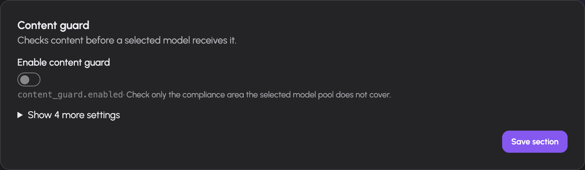

# Configure system features

Open **Administration → Settings** (`/admin/settings`) with the `admin` role. The categories are Chat, Tools, Data, Access, Notifications and Web search. Settings cards show the effective configuration from the server; model pickers use models available for the required pool kind.

## Change a setting

1. Choose the category and find the feature's card.
2. Read its prerequisites and set its model, service URL or directory before enabling it.
3. Save that card. Cards save independently.
4. Check the success message and restart-pending banner.
5. For restart-required fields, restart through your deployment's normal process and verify the feature afterwards.

Most fields reload without restart. The declared restart fields are `comfyui.base_url`, `comfyui.content_dir`, `rag.enabled`, `rag.data_dir` and `rag.clone_concurrency`. The UI also reports its pending list explicitly. A disabled feature does not become usable merely because its service URL is filled in.

Settings are stored in the database. Secrets are write-only: the UI shows whether one is set, not its plaintext. Leaving a secret input blank during Save preserves the stored value. Use its explicit Clear action, with confirmation, to remove it. Clearing a stored setting uses its built-in fallback; it does not re-import an arbitrary value from a configuration file.

The [field reference](settings-reference.md) lists every declared field and its meaning. The operating system's persistent paths and externally reachable services remain deployment responsibilities.

## Chat and documents

- **OCR:** Select an OCR-pool model and configure document/page/output limits, resolution, timeout, concurrency and the text threshold used to identify scanned PDFs. This reads document text; it does not provision an OCR upstream.
- **Compaction:** Control when long conversation history is summarized, the assumed context window for unknown models, recent turns preserved verbatim, minimum conversation length and summary token budget. Verify model-specific context windows in the [catalog](models.md).
- **Parallel turns:** Set how many different conversations a user may run simultaneously. The default is one.
- **Attachments:** Configure the S3 endpoint, region, bucket, key prefix and credentials in Data. Enable attachment storage only with a working bucket.

OCR uses the document-aware sidecar under `deploy/ocr-sidecar` through a dedicated `ocr` pool. The sidecar owns PDF rasterization and model inference; AIplane owns derivative caching, configured limits, queued/running/completed/failed state and usage accounting. OCR models are excluded from user-facing chat model lists. A generic chat endpoint is not sufficient for this internal multipart contract. Extracted text is treated as untrusted document content. Verify a scanned document and its page ordering after configuration.

## Tools and data services

| Card | Configure before enabling | Where to check the result |
|---|---|---|
| Sandbox | Private sandbox-runner URL, deadline and returned-file size cap | A permitted code tool in chat |
| ComfyUI | Private worker URL, workflow directory and job limits | [Workflow catalog and Jobs](integrations.md#operate-comfyui-workflows) |
| Typst | Template directory available to AIplane | Document/PDF tools |
| GeoIP | IP2Location database path and optional update token | Location tool |
| RAG | Persistent index directory and indexing concurrency | [Knowledge collections](knowledge.md) |
| Skills | Readable/writable bundle directory | [Skill management](integrations.md#install-and-grant-skills) |

Sandbox-runner and ComfyUI are privileged services. Their settings help explicitly requires making them reachable only from the gateway. Adding a service is separate from granting its tools to users and agents.

The sandbox gateway client sends code execution to the standalone runner; runner configuration enforces actual isolation, egress policy and resource caps. Generic code execution can reuse a working directory during one turn. Test stdout/stderr and an artifact with an allowed account. File delivery in browser chat also needs configured attachment storage. The gateway's `sandbox.timeout_secs` is an HTTP deadline, not a replacement for runner resource limits.

Typst rendering needs the `typst` executable on the AIplane process PATH. One subdirectory per template contains `template.typ`, `template.toml` and its local assets. The manifest defines the template's ID, title/description, input fields and output basename. A settings save rescans the configured template directory and rebuilds its tool surface. The renderer applies a 30-second compile timeout and a 25 MiB PDF size cap. Optional editable office exports use the sandbox. Verify the declared template inputs and rendered output before granting the `typst_<id>` tool family.

GeoIP reads an IP2Location LITE DB11 BIN file. Its optional token supports database updates; the file can be reloaded when changed. Client-IP location is approximate and fields may be missing. Browser-shared position is separate user-provided data. Behind a proxy, configure trusted proxy handling so the gateway uses the actual client address; a missing/private IP or unavailable database must not be interpreted as a precise location.

Moving the RAG data directory does not move existing indexes. Review persistent storage before changing it. A profile, credentials or an embedding model is configured on the collection, not on the global RAG card.

## Access and content guard

The Usage card enables per-request accounting, retention and display currency. The Limits card enables enforcement of rules from `/admin/limits`. Gateway settings control token/session lifetimes and impersonation. See [access management](access.md).

The **content guard** checks request messages against the compliance area that a destination chat pool does not cover. A pool declared GDPR- and NDA-covered skips these checks. For a pool missing either declaration, AIplane sends the request messages to the configured **System One** guard model and checks the corresponding area.

1. Configure a reachable System One pool and model.
2. Review the guard model's own GDPR/NDA badges: the guard receives the content it evaluates.
3. Enable the guard and begin in **Monitor** mode. This logs decisions; evaluation errors permit the request in monitor mode.
4. Set separate GDPR and NDA actions: allow, confirm or deny.
5. Choose **Enforce** to apply those actions. Evaluation failures in enforce mode return an error.

The implementation uses a five-second guard request timeout and a match threshold of 0.5. When either matched policy is deny, denial takes precedence. Confirmation in browser chat requires a connected prompt receiver and an affirmative answer within three minutes. API requests cannot show that browser prompt and return a confirmation-required error.

These checks use model classification and operator pool declarations. They are not verification of provider contracts or a guarantee that a classifier detects every sensitive passage.

## Notifications and feedback

Configure Feedback with the selected GitHub or GitLab tracker, its issue destination, credentials and labels. GitHub screenshot assets have a separate assets branch. Set the extraction and voice models when those feedback inputs are needed. Stored credentials remain write-only; switching the selected tracker leaves the other tracker's configured fields available.

Push settings enable browser push support and set the VAPID contact identity. Users still need to enable notifications in their own browser/settings. Agent Slack/Discord webhook channels are configured on the agent's [Sharing screen](../agent-guide/run-observe.md), not on this global card.

## Web search

The Web search category has its own provider card. Choose the provider, set the SearXNG URL or Brave API key as appropriate, and configure the optional Tavily settings. Existing API keys are preserved by blank inputs; use each clear-key control to remove one. Save and test a permitted search tool in chat. Selecting a provider does not grant the tool to users.

## Troubleshooting

| Symptom | Check |
|---|---|
| Model menu empty | Backend health and correct pool kind |
| Feature enabled but unavailable | Feature prerequisites, process-readable directory and tool grants |
| Old worker or index path still in use | Restart-pending list and deployment restart |
| Secret seems blank | Set/unset indicator; write-only values are intentionally not returned |
| Content guard rejects everything | Guard service error, enforce mode and System One availability |
| Confirm action fails without a prompt | Connected browser chat versus API caller; three-minute deadline |
| New RAG path has no indexed data | Indexes do not move with a settings change |
