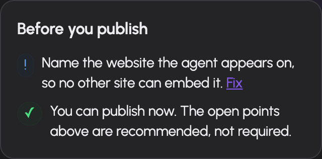

# Create and configure an agent

An AIplane agent combines a model, instructions, selected tools/skills, structured state and optional routes to other agents or people. It acts through a system principal with explicit resource grants. A draft can be edited and tested; a published snapshot serves production callers.

You need `can_manage_agents` on a resolved group to use the builder. Ask an administrator to configure that permission in [Groups](../admin/access.md). To change an existing agent you also need write access to it. Administrators can manage agents through their administration rights.

## Create an agent

1. Open **Agents** (`/agents`) and choose Create.
2. Enter its display name and describe its actual purpose.
3. Inspect the generated technical ID. Use Change ID if necessary; the form accepts lowercase letters/numbers separated by hyphens, up to 48 characters.
4. Create. AIplane opens `/agents/<id>/setup/start`.
5. Complete the setup steps and review the checklist before publishing.

The list shows name, description when supplied, live version or unpublished state, update date and read-only/disabled badges when applicable. A new agent does not inherit all the creator's resources. Configure [grants](permissions.md) for its model and abilities.

## Follow the setup assistant

The assistant edits the same agent spec used by the advanced editor.

| Step | What you decide |
|---|---|
| Start | Starting configuration/template for the agent's task |
| Basics | Display identity, main model and working/response instructions |
| Scope | Topics handled and refusal behavior; optional strict scope checking |
| Abilities | Permitted tools and skills used for the task |
| Details | State slots the conversation needs to collect |
| Identity | Verification required before trusted actions |
| Routes | Conditions for another agent or a human to take a task |
| Site | Website/widget configuration |
| Review | Blocking setup issues and recommended improvements |

Use the labels shown in your language; technical step IDs are `start`, `basics`, `scope`, `abilities`, `slots`, `identity`, `routes`, `site` and `review`.

The overview links back to each section. Features configured in the advanced editor may be marked as advanced rather than simplified into fields the assistant cannot represent. Review them in that editor.

## Use the architect and suggestions

The agent list offers the Architect conversation, and agent setup has contextual assistance and text suggestions. The architect uses a persisted conversation; closing its modal closes the active stream, and reopening resumes the conversation. It can use builder tools, so inspect resulting agent changes and grants rather than assuming its output is only explanatory prose.

Use assistance to refine a real task: provide its intended users, data sources, required operations and handoff conditions. Check proposed instructions against your actual processes. Generated instructions are agent configuration, not verification that the underlying tools or data sources exist.

## Edit the complete spec

Open the agent's **Setup** tab and enable the advanced editor. Its **Edit**, **Canvas**, **JSON** and **Grants** views share one working spec. Switching views does not create a second agent configuration.

### Main behavior and scope

Select a chat model from the granted model catalog. Leaving `main.model` unset uses the gateway's default chat model, which still needs appropriate availability and grants. Set orchestration instructions for how the agent works and response instructions for how it answers.

Select tools and skills. The editor also accepts an explicit tool ID for a resource not in the displayed list, but typing an ID does not grant it or make it exist. Tool settings include bound arguments, permission policy and approval timeout. Run budgets can cap rounds, seconds and tokens.

Scope topics and a refusal message guide the agent. Strict scope additionally runs a topic classifier before the main model sees an out-of-scope message. Configure its classifier model deliberately; when omitted, the scope classifier uses the main run's model.

### Structured state and identity

State slots have a type, allowed writers and optional validation. Types are string, email, enum, integer, number, boolean and subject. String constraints, number bounds, enum values and subject schemas apply to their corresponding slots.

The allowed writer (`set_by`) matters: information stated by a visitor is not equivalent to an identity verified by a trusted mechanism. Verification mechanisms include MCP code verification, lookup and host JWT. Route gates can require the appropriate trusted state before proceeding. Configure the tool/connector inputs and resulting state writes for the chosen verifier; publish validation reports missing requirements.

### Routes and completion

A route has a condition, optional description, task/bound inputs where applicable, and exactly one target: another agent, human handoff, remote A2A agent or worker/critic loop. The router can use rules or a classifier. Check its ordering and required state with [test cases](test-publish.md).

The optional `finish.schema` defines the structured completion contract for a routed agent run. It supports the validator's JSON Schema subset, not arbitrary schema keywords. Invalid fields are reported by path on save/publish.

### JSON and canvas

Use JSON for advanced spec fields and copyable review. Applying parsed JSON updates the editor buffer; Save persists it. Unknown keys are rejected by server validation. The canvas provides another view of the same configuration and can show the latest test debug information. The [spec field reference](spec-reference.md) describes the supported structures and constraints.

## Save, publish or delete

The header shows unsaved state, live version, read-only state and setup issues. **Save** persists the draft. **Publish** validates and snapshots it; see [testing and publication](test-publish.md). Live callers use a published version, so saving a draft alone does not update them.

Delete requires confirmation. Inspect production callers, embed keys and shared responders before removing an agent. Validation errors should be corrected at the named spec path; do not mask them with invented resource names.

## Troubleshooting

| Symptom | Check |
|---|---|
| Builder access refused | `can_manage_agents` on a resolved group |
| Agent opens read-only | Agent share access and management rights |
| Model/tool selection absent | Agent grants and resource availability |
| Setup says advanced configuration | Open advanced Edit/JSON for those fields |
| Save fails | Reported field path, supported key/type and referenced resource |
| Production behavior unchanged | Saved draft versus published live version |
