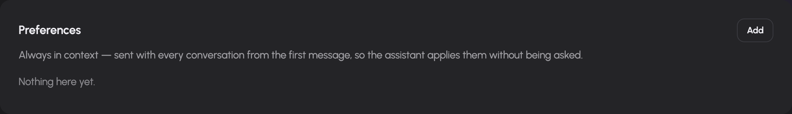
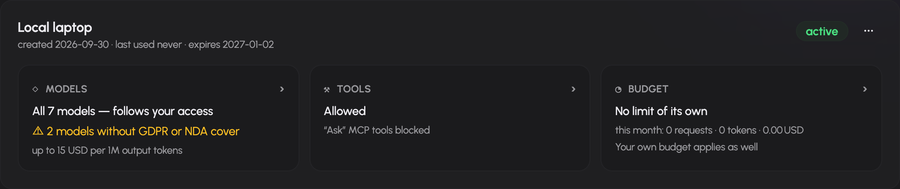

# Account, memory, tokens and usage

Settings separates your identity, stored memory, API tokens and device notifications. Usage provides the accounting view. Administrator grants and limits continue to apply to the features configured here.

## Inspect your account

Open `/settings` to see your signed-in email, internal user ID, identity-provider roles and resolved AIplane roles. These roles can differ because the installation maps identities to its authorization model. Ask an administrator about missing rights; this page does not edit your identity-provider roles.

## Manage memory

Open **Settings → Memory** (`/settings/memory`). The three cards have different purposes:

| Kind | Use | How the assistant receives it |
| --- | --- | --- |
| Preferences | Response style, units, language and other standing preferences | Included in the standing context when Memory is granted and enabled, subject to its context budget. |
| Project context | Background about ongoing work | Retrieved on demand through memory tools. |
| Facts | Stable details to recall when relevant | Retrieved on demand through memory tools. |

Select **Add** on the appropriate card, enter the content and save. The add dialog lets you correct the kind before saving. Edit existing text inline and select Save; use Delete and confirm to remove an entry. The browser editor limits each entry to 2,000 characters.

When the memory tools are available, you can also ask the assistant to remember, recall, correct or forget information. Check the memory page to verify the resulting stored entries.

Preferences use a bounded standing section: the driver reads up to 50 recent preferences and applies a 3,000-character budget, while keeping at least the first preference. Older or omitted entries can be looked up through recall. Turning Memory off stops its use and standing-context injection; it does not delete the stored entries. Deleting an entry does not remove text already present in earlier chat messages.

## Create an API token

Open **Settings → Tokens** (`/settings/tokens`).

1. Select **Create token**.
2. Give the token a name that identifies the application or device.
3. Choose its lifetime in days. The UI accepts 1–1,825 days and starts with 90.
4. Create it and copy the plaintext value from the reveal panel immediately.
5. Follow the **Guides** tab for the client you want to configure.

The plaintext is revealed at creation or rotation; it cannot be retrieved from a normal token listing. Store it as a credential, not in a document, screenshot or source repository. New tokens have gateway-owned tool execution disabled by default.

Each token card provides three configuration areas:

- **Models:** restrict the token to selected models within its effective permissions. The picker groups models by kind, such as chat, embedding and reranking. Administrator restrictions are displayed and remain applicable.
- **Tools:** enable gateway-owned tools and set their capability states. A separate MCP policy switch controls MCP access for the token.
- **Budget:** add request, token or cost quotas with hourly, daily, weekly or monthly windows. Owner limits still apply and are displayed separately; user configuration cannot remove administrator-owned quotas.

Use the token's menu to rotate or revoke it. Rotation reveals a replacement credential; update clients that use the old value. Revocation prevents further use. A revoked token card offers removal. Expired and revoked status are shown explicitly.

## Read usage and limits

Open `/usage`. Choose a period and optionally filter by source, backend or API token. The page summarizes usage and groups it by backend, source, model and token. Users with permission to view all usage also receive an all-users scope and per-user table; other users see their own scope.

Your applicable limits appear in the personal view. Cost depends on the installation's configured pricing. An unpriced-model warning means the displayed cost cannot account for those models reliably. If usage collection is disabled, the page reports that condition; an empty accounting view is not proof that no requests ran.

When a limit blocks a request, inspect the window and dimension and contact the administrator if necessary. Token quotas are additional constraints, not permission to exceed owner-level limits.

## Enable device notifications

Open **Settings → Notifications** (`/settings/notifications`). When the operator enables push notifications and your browser supports them, select Enable and allow the browser permission prompt. Notifications can alert this device when an assistant turn you started finishes while you are away.

Use Disable to stop this device's subscription. If browser permission was denied, change the site's notification permission in the browser first. An unavailable warning indicates installation configuration or browser support must be addressed.

## Report a problem

Use the feedback button in the composer, or the floating feedback button on other pages. The dialog lets you describe the problem, attach images and review or annotate a screenshot. Review diagnostic and conversation-sharing consent controls before submitting. The public-tracker confirmation matters: do not submit confidential material to a public issue.
