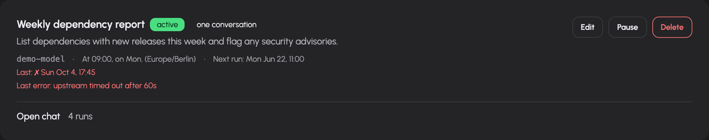

# Schedules, webhooks and inbox

Schedules run a prompt at configured times. Webhooks run a prompt when another system calls a secret trigger URL. Their results are saved as conversations and run history. Use the inbox when work needs a human decision.

## Schedule a recurring task

1. Open `/scheduled` and select the new-schedule action.
2. Enter a name, choose an available model and write the prompt.
3. Select hourly, daily, weekly or monthly timing; use Advanced for a five-field cron expression.
4. Choose a timezone and inspect the summary and upcoming-run preview. Weekly schedules require at least one weekday.
5. Decide whether tools should be enabled for the run.
6. Decide whether runs should reuse a conversation. If enabled, choose the history window, from 1 to 50 rounds, and optionally select an existing conversation through the linked-chat picker.
7. Save, then inspect the schedule card's next-run time and active status.

The form accepts names up to 128 characters and prompts up to 8,000 characters. It displays configured GDPR and NDA metadata warnings for the selected model. Choose a model appropriate to the actual data in the prompt.

Fresh conversations keep runs independent; reusing a conversation carries the configured recent history into subsequent runs. The schedule card links to the resulting chat or run history, depending on what exists. It displays the latest success or failure and any recorded error.

Use **Pause** to prevent future scheduled runs, **Resume** to reactivate, **Edit** to change configuration, or Delete and confirm to remove the schedule. The page does not provide a manual run-now button.

## Create an event-driven webhook

1. Open `/webhooks` and select the new-webhook action.
2. Enter a name, model and prompt describing how to process the incoming event body.
3. Choose synchronous or asynchronous execution.
4. Decide whether to enable tools. Tools are disabled by default in the new-webhook form; enabling them displays a warning because an external trigger can cause work under your account.
5. Optionally enable conversation reuse and choose its recent-history window and linked chat.
6. Save and copy the secret trigger URL from its reveal panel.
7. Configure the event source to call that URL with its payload.

The trigger URL's secret is the credential. Possession of that URL allows a caller to trigger the webhook while it is enabled. Keep it private. The prompt receives the request method, content type and body as event input. It is not a template in which you must invent payload placeholder syntax. The trigger body is capped at 256 KiB.

| Mode | HTTP behavior |
| --- | --- |
| Asynchronous | Returns HTTP 202 with `status: accepted` and a `session_id`; the run continues in the background. |
| Synchronous | Waits for the run and returns HTTP 200 with output on success, or HTTP 502 with a run error. |

Acceptance does not mean successful execution. Follow the recorded conversation and run status.

## Inspect and replay webhook runs

A webhook card shows active/paused state, execution mode, latest status, chat and run-history links. Run history records the payload and the prompt used for that fire. These can contain sensitive event data.

After a payload has been stored, use the rerun link to replay it with a prompt. Run history can also identify a specific older run to replay. Rerunning creates new work and can execute tools again; use it deliberately for debugging or revised processing.

Use Pause or Resume to control future triggers. A paused or invalid trigger returns not-found behavior. Rotate the secret when you need a replacement trigger URL, and update the event source. Delete removes the configured webhook after confirmation.

## Answer requests in the inbox

Open `/inbox` to review pending requests visible to your account. The navigation badge updates as waiting items change. Items can include a chat or agent context and a link back to the originating work.

1. Read the request, its origin and any visitor message or supplied slots.
2. Expand transcript context when offered.
3. For approval, inspect the tool name and arguments before choosing an available decision.
4. For a requested answer or value, fill in the supplied field and submit.
5. Check that the item was settled and follow the original conversation to inspect resumed work.

The card only offers decisions the server permits. Expiry information appears when the request has an expiry. If another person already settled it or it expired, the page reports that state and refreshes; your later click does not replace the earlier decision. Sensitive-value requests can use a password field rather than a visible text area.

## Troubleshooting

- **No upcoming schedule run:** inspect the cron expression, selected weekdays and timezone preview.
- **Run fails:** inspect the recorded error and conversation. Model grants, upstream health, tools and owner limits can affect execution.
- **Webhook returns accepted but there is no useful output:** inspect run history; HTTP 202 only acknowledges acceptance.
- **Webhook returns not found:** verify the current secret URL and active state.
- **A run waits for a decision:** check the inbox or linked conversation and answer the pending request.
