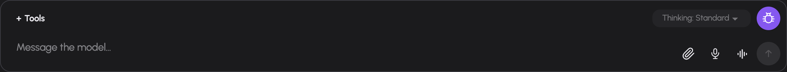

# Conversations

Use a conversation for a continuing task: its messages, attachments, generated assets and documents belong together. You must be signed in to use browser chat. The owner can change a conversation; another signed-in user can read it when the owner enables sharing.

## Choose a model and capabilities

Choose the model from the header before sending a message. The available list is filtered by permissions. Configuration can also expose automatic routes or aliases through the shared model list. Compliance indicators in the picker describe the installation's configured model metadata; they are not a certification produced by AIplane.

The composer offers **Fast**, **Standard**, **Deep** and **Max** effort levels. Effort is disabled when the selected model has no supported reasoning parameter. It is a model request setting, not a guaranteed response time or quality level.

Select **Tools** in the composer to inspect capabilities available to this conversation. Search or browse groups and select their state:

| State | Effect |
| --- | --- |
| Off | Hidden from the assistant for this conversation. Some capabilities cannot be disabled. |
| Automatic | The assistant can enable the capability when the request needs it. |
| Always on | The capability is available without that activation step. |

Changing a conversation's capability state does not grant a capability your account lacks. Removing an active capability badge returns it to Automatic. For account-level switches and external-service consent, see [Tools and integrations](tools-and-integrations.md).

## Send, redirect and stop work

Write text, add any attachments, then press Enter or Send. Shift+Enter inserts a newline. Replies stream into the transcript. You can expand tool-call details to inspect what the assistant did and what the tool returned. Reasoning displays depend on what the upstream provides.

While a reply is running, you can still send another message. The server decides whether it joins the running work or waits as a later turn. A queued message is shown as waiting and can be cancelled before it starts.

For a deliberate change of direction, type the new instruction and select **Interrupt**. This sends the instruction and stops the current answer so the instruction can start as new work. **Stop** cancels the current turn without sending a new instruction.

## Answer questions and approvals

A tool can ask a question, request a decision, or pause for approval. Read the question and the available choices. Select an explicit choice when approving an operation; explanatory free text is not a substitute for selecting an approval option.

Some questions replace the composer until answered or skipped. A suspended turn holds the conversation until its decision is answered. Shared-conversation readers cannot answer on the owner's behalf. Requests that can be answered through the inbox are also described in [Automation and inbox](automation-and-inbox.md).

Location requests have a dedicated share button and use the browser's permission prompt. Skipping a location request does not grant location access.

## Correct or regenerate messages

When no answer is streaming, the owner can edit a user message or retry an assistant response. Editing can add new files while keeping existing attachment references.

Both operations are destructive to the later transcript:

- **Edit and regenerate** replaces the selected user message and removes all messages below it.
- **Retry** removes the selected reply and everything below, then regenerates with the currently selected model.

Read the confirmation before proceeding. If you need to retain the original, export it first.

## Share and fork

Select the sharing button in the header to enable sharing, then give another signed-in user the conversation URL. Sharing makes the conversation readable by **any signed-in user on the installation**, not a selected recipient list. It is not an anonymous public link.

A reader sees a read-only conversation and can select **Fork** to copy it into their own conversations and continue there. Attachment copying is best effort; if the storage copy fails, a fork can retain text with unavailable attachment references. Turning sharing off removes access through the original shared conversation; it does not remove copies already made through Fork.

## Export

Open **Export** in the header and choose Markdown or PDF. Markdown is useful for further processing and documentation; PDF is useful for a fixed reading copy. Access to the export follows access to the conversation.

## Troubleshooting

If sending fails, the composer restores the submitted text and files and shows a notice. Read the notice before sending again. If a conversation is paused, answer its outstanding decision first. If another person already settled an approval, refresh the state rather than submitting an alternative decision.

Model, transcription and speech-voice controls in the header are hidden below the small-screen breakpoint. Use a wider viewport when you need to change those settings.
