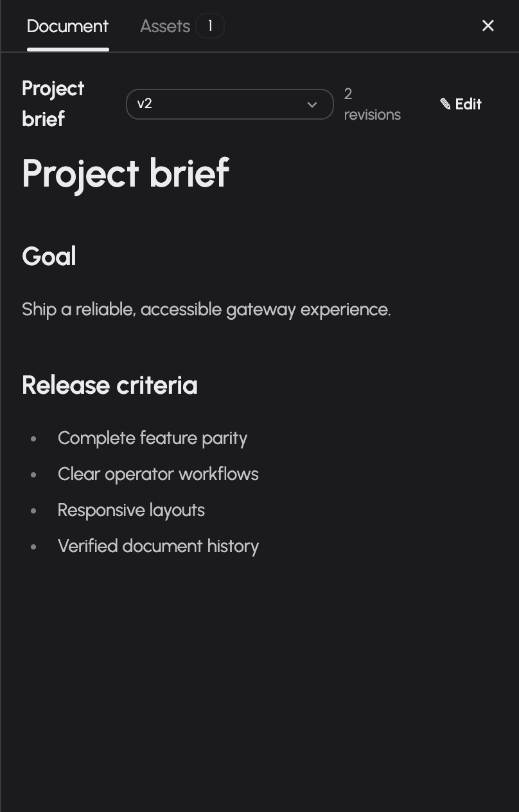

# Files, documents, images and voice

Attachments give the assistant material for a conversation. Documents in the canvas provide a revisioned working text; generated assets provide downloadable output. These are separate kinds of content with separate controls.

## Attach a file

1. Open a conversation you own.
2. Select the paperclip, drag files onto the conversation, or paste an image from the clipboard.
3. Check the filename badges and remove any unintended files before sending.
4. Describe the task and send the message.

You can send files without accompanying text. Dropping a directory is not supported. Files dropped while the message-edit dialog is open are added to that edited message, not to the main composer.

Attachment availability depends on the operator's storage configuration. How content reaches the model depends on its type and the configured processing: text can be included as text, images can be supplied to a vision-capable model, and other files can require file-reading or conversion tools. Attaching a file does not mean every selected model can understand its content directly. Ask the assistant to explain any extraction or conversion failure.

Attachment chips in the transcript allow downloading. The owner can remove an attachment when no answer is streaming. Removing an attachment is a mutation of that message; it is not a way to retract material already processed by an upstream or copied elsewhere.

## Work with a document in the canvas

Ask the assistant to create or edit a document when the document capability is available. A generated document appears in the canvas alongside the conversation. The header's canvas button lets you reopen the panel.

1. Select the **Document** tab.
2. If the conversation contains several documents, choose one from the selector.
3. Use the version selector to read an earlier revision.
4. Select **Edit** to change the Markdown content yourself, then **Save** to create a user-authored revision. Cancel discards the unsaved draft.
5. Ask the assistant to make further changes in the conversation.

If a newer revision arrives while your manual edit is open, the panel warns you and offers to load the newer version. Review that warning before saving. Saving a manual edit is not an automatic merge of both versions.

On wide screens you can resize the canvas by dragging its left boundary; the focused resize control also accepts left/right arrow keys. On smaller screens the canvas overlays the conversation and can be closed to return to chat.

## Download generated assets

The **Assets** tab lists generated files with their filenames, MIME types and sizes. It previews images, audio and video where supported and provides a download button for each asset.

Ask for image generation, PDF output, document conversion or other produced files through the relevant available tools. These capabilities depend on configured backends and grants. Use the installation's [tool inventory](../tools-inventory.md) to see the tool families and their requirements. A document in the canvas is not itself a downloaded office document; request the intended output format explicitly.

## Dictate a message

When a transcription model is configured and available, a microphone button appears beside the composer. Choose the transcription model in the desktop header, activate dictation, allow microphone access and record. Transcribed text is appended to the composer so you can review it before sending.

Dictation changes the draft; it does not send the message automatically. If there is no microphone control, the installation has not exposed a transcription model to this chat.

## Use a spoken conversation

Voice mode appears when both transcription and speech output are available. Open it using the voice button, tap the microphone to talk, and tap again to send. The dialog shows listening, working and speaking states and captions for your speech and the reply. Close the dialog to leave voice mode.

The speech voice selector appears in the desktop header when the installation offers at least two voices. Audio requests require browser microphone permission and an appropriate browser security context. Check microphone permissions and the displayed error when recording fails.

## Troubleshooting

- **Attachment upload fails:** check the displayed storage or size error and ask the operator about storage configuration and limits.
- **Image is not understood:** choose a model with the required vision support or use an available extraction tool.
- **Conversion fails:** retain the tool error. The required converter or sidecar may not be configured.
- **Canvas button is absent:** the conversation has no canvas document or asset to show.
- **Voice button is absent:** transcription and speech output are both required for voice mode.
