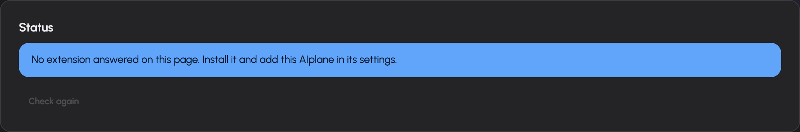

# Tools, integrations and skills

Tools let the assistant take actions or retrieve information. A capability must be configured, granted to your account and enabled for the intended context. The assistant's ability to describe a task does not mean the required tool is available.

## Manage account-level tools

Open **Tools** (`/tools`). The page groups granted tools by category and provides account-level switches. A tool that needs configuration leads to its configuration surface rather than behaving as a simple switch. If no tools are listed, ask your administrator which grants apply to your account.

Use the conversation's capability picker for a conversation-specific Off, Automatic or Always on state. These states control availability to the assistant; integration approval modes control whether an available external-service action needs your permission. See [Conversations](chat.md) for the picker.

The [tool inventory](../tools-inventory.md) is the detailed reference for tool IDs, families, configuration gates and toggle keys. It includes the existing retrieval, search, document, image, code and utility tools. Installation-specific tools can also be discovered through configured connectors and workflows.

## Share or forget your location

When available, the location card on Tools lets you share browser location or forget a previously shared location. Sharing requires a browser permission decision. The card reports whether a location is shared and its reported accuracy. The assistant may also ask for location during a task; use that request's share or skip controls.

Forgetting the stored location does not erase information already included in earlier conversations.

## Connect an external service

Open **Tools → Integrations** (`/tools/integrations`). Each visible connector comes from the installation's configuration and your grants.

1. Find the connector you need.
2. If it requires administrator setup, ask the administrator to finish that setup.
3. For an OAuth connector, select **Connect** and complete the provider's authorization flow. For a bearer-token connector, enter the provider token in its password field and select Connect.
4. Check the connected status and expand the tool list.
5. Set each tool's mode or use the controls that set all tools for that connector.

| Integration mode | Meaning |
| --- | --- |
| Always | Allow that connector tool to run without a per-call approval. |
| Ask | Require a decision before the tool call runs. |
| Off | Block that connector tool. |

Read/write badges describe the connector's discovered tool metadata. Review the tool's description and arguments when deciding what to authorize. A global connector is configured by the operator and does not require your own sign-in.

Use **Reconnect** when credentials or tool discovery fail. Use **Disconnect** to remove your connection after confirming the action. A disconnected personal connector cannot supply its tools through that connection. If the tool list is unavailable, the card displays the discovery error; reconnecting or operator configuration may be required.

## Use browser control



Open **Tools → Browser** (`/tools/browser`) and follow the status card. It distinguishes a missing grant, disabled tool, undetected extension, switched-off extension and ready connection.

1. Install the browser extension using the page's store link or download. The page also provides instructions for loading an unpacked extension.
2. Pair the extension with the exact AIplane origin shown on the page.
3. Enable the browser-control tool in Tools if it is switched off.
4. Switch the extension on using its own controls. A button in AIplane can open the extension's activation UI, but the activation decision happens in the extension.
5. Keep your conversation open and ask the assistant to perform the browser task.

The assistant works in its own window and an **Assistant** tab group. The extension icon turns green while active and Chrome shows a debugging notification. Switch it off from the extension when finished. In the extension settings, restrict allowed sites when appropriate. Page content can contain instructions aimed at an assistant; examine consequential actions carefully.

If detection fails, confirm the paired origin and select **Recheck**. If AIplane cannot open the activation popup, use the extension icon directly.

## Author a personal skill

A skill provides reusable instructions and supporting files. Personal skills require the operator to enable personal-skill storage.

1. Open **Tools → Skills** (`/tools/skills`).
2. Select the new-skill action or upload a `.skill` archive.
3. For an authored skill, fill in the manifest's `name`, `title` and `description`, then write its instructions in Markdown.
4. Save and inspect its rendered instructions and file list.
5. Use the skill in an appropriate conversation with the required capabilities available.

The supplied editor template is:

```markdown
---
name: my-skill
title: My Skill
description: One line describing when the assistant should use this skill.
---

# Instructions

Write what the assistant should do when this skill is loaded.
```

You can edit, download an archive or delete a personal skill. A personal skill with the same name as a global skill shadows it for your account. Global skills are filtered by role grants; personal authoring does not grant additional tools or models.
